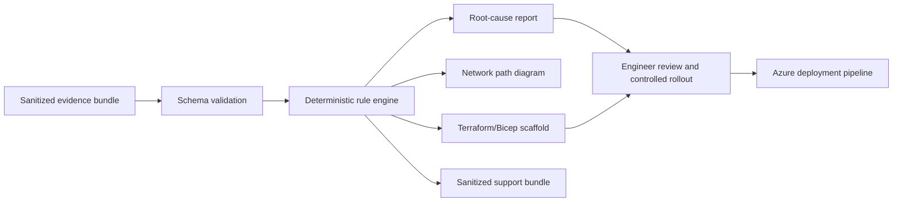

# Azure Private Link Doctor

An offline-first, evidence-driven diagnostic engine for Azure Private Endpoint, Private DNS, hybrid DNS, routing, NSG, and service-firewall failures. It turns a sanitized JSON evidence bundle into deterministic root causes, a path visualization, support evidence, and Terraform/Bicep remediation scaffolds—without changing Azure.

> The expensive problem is rarely creating a private endpoint. It is proving why an application still cannot reach it across DNS, routing, policy, and hybrid-network boundaries.

## What it proves

- Azure Private Link and Private Endpoint troubleshooting
- Azure Private DNS and split-horizon DNS diagnostics
- Azure DNS Private Resolver and hybrid/on-premises forwarding design
- Network security group and user-defined route analysis
- Infrastructure as Code with Terraform and Bicep
- CI/CD validation, sanitized evidence, and support-ready incident artifacts
- Production-minded automation: deterministic findings, explicit confidence, no autonomous mutation



## Six reproducible incident labs

| Scenario | Failure isolated | Principal finding |
|---|---|---|
| `missing-vnet-link` | Workload VNet cannot use the private zone | `PE-DNS-003` |
| `postgres-nxdomain` | PostgreSQL private FQDN is intercepted as NXDOMAIN | `PE-DNS-005` |
| `onprem-invalid-forwarder` | On-premises DNS forwards directly to Azure's virtual resolver IP | `PE-RESOLVER-001` |
| `resolver-ruleset-unlinked` | DNS forwarding ruleset exists but is not associated with the source VNet | `PE-RESOLVER-002` |
| `nsg-deny` | Effective NSG policy blocks the application flow | `PE-NSG-001` |
| `route-bypasses-nva` | Effective route bypasses the required next hop | `PE-ROUTE-001` |

The checked-in [`evidence/`](evidence/) outputs make the results reviewable without an Azure subscription. They are generated from synthetic, sanitized fixtures and are not presented as live tenant evidence.

## Run locally

Requires Python 3.11+ and has no runtime dependencies.

```bash
python3 -m venv .venv
source .venv/bin/activate
python -m pip install -e .
linkdoctor examples/missing-vnet-link.json --output generated/missing-vnet-link --fail-on-diagnosis
```

Exit codes are automation-friendly: `0` for a complete healthy report, and `2` for incomplete evidence or a diagnosis when `--fail-on-diagnosis` is set.

Run the complete validation suite:

```bash
bash scripts/validate.sh
```

The suite executes unit tests, diagnoses all six fixtures, and compiles the generated Bicep template when Azure CLI is available.

## Outputs

Every run emits:

- `diagnosis.json` — machine-readable status, findings, evidence references, and recommended actions
- `diagnosis.md` — incident-review report
- `network-path.mmd` — Mermaid path and failure markers
- `remediation/main.tf` — conservative Terraform scaffold
- `remediation/main.bicep` — conservative Bicep scaffold
- `remediation/README.md` — review and rollout guidance
- `support-bundle.zip` — sanitized inputs and outputs for escalation

The remediation is deliberately a scaffold, not an autonomous production change. An engineer must confirm the intended DNS ownership, IP addresses, network boundaries, and change window.

## GitHub Actions

```yaml
- uses: AAH20/azure-private-link-doctor@main
  with:
    bundle: examples/missing-vnet-link.json
    output: generated/linkdoctor
    fail-on-diagnosis: "true"
```

## Why this has commercial value

Private connectivity failures block application releases, database migrations, zero-trust programs, and cloud modernization. The same cross-layer investigation recurs across engineering, platform, network, security, and vendor support teams. A repeatable evidence contract reduces triage time, makes escalation reproducible, and converts expert troubleshooting knowledge into a distributable workflow.

See [unit economics](docs/UNIT-ECONOMICS.md), [architecture](docs/ARCHITECTURE.md), and [production roadmap](docs/PRODUCTION-ROADMAP.md).

## Accuracy and scope

Version `0.1.0` analyzes supplied evidence only. It does not query Azure, deploy resources, validate live packets, or claim that a generated remediation is safe for every topology. Live Azure Resource Graph, Network Watcher, DNS probe, and policy adapters are explicitly roadmap items. The rule assumptions follow Microsoft's [Private Endpoint DNS troubleshooting](https://learn.microsoft.com/en-us/troubleshoot/azure/private-link/troubleshoot-private-endpoint-dns-resolution) and [Private Endpoint connectivity troubleshooting](https://learn.microsoft.com/en-us/troubleshoot/azure/private-link/troubleshoot-private-endpoint-connectivity-failure) guidance.

## Commercial deployment

Need this adapted to a landing zone, hub-and-spoke network, Azure Virtual WAN, on-premises DNS, or an MSP incident workflow? [Request an architecture and diagnostic engagement](https://a2zsoc.com/contact?topic=azure-private-link-doctor&utm_source=github&utm_medium=repository).

MIT licensed. See [SECURITY.md](SECURITY.md) before attaching evidence from a real tenant.
