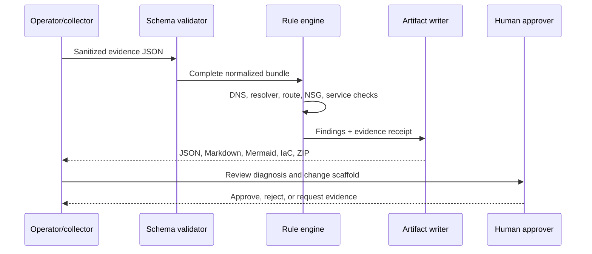

# Architecture

## Design principles

1. **Evidence before inference.** Missing mandatory evidence yields `INCOMPLETE`; it is never silently treated as healthy.
2. **Deterministic core.** Identical evidence produces identical ordered findings and receipt hashes.
3. **Explainable decisions.** Every finding names the observed evidence, expected condition, impact, and action.
4. **Read-only by default.** Collection and diagnosis are separated from change execution.
5. **Portable contract.** The JSON bundle works locally, in CI, and eventually behind Azure-native collectors.

## Processing path

## Evidence contract

The current contract requires metadata, endpoint, DNS, network path, and policy sections. Fixtures intentionally remain small so each failure is auditable. Future live collectors should populate the same contract from Azure Resource Graph, Network Watcher, effective routes/security rules, Private DNS, DNS Private Resolver, and service configuration APIs.

## Trust boundary

The engine does not receive Azure credentials. A future collector should run with least-privilege read access, emit a sanitized bundle, and terminate. Any executor must be a separate component with policy gates and human approval.

## Known limits

- No live Azure discovery in `0.1.0`
- No packet capture or connection monitor execution
- No inference across overlapping DNS views beyond supplied evidence
- Generated IaC contains placeholders where tenant intent cannot be safely inferred
- Finding coverage is intentionally narrower than the complete Azure networking surface
